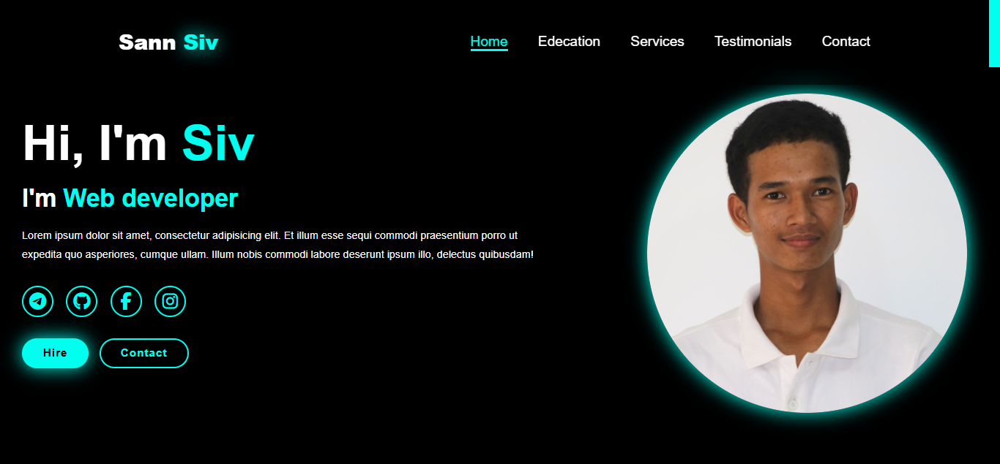

#  👨‍🎓Portfolio
[](https://lucky-pegasus-c8845a.netlify.app)

A personal web-based portfolio designed to present and highlight an individual’s academic background, skills, achievements, and projects. This application provides a structured way to showcase your work, helping potential employers, clients, or collaborators learn more about you.

---
## 📚 Table of Content
- [Home](https://lucky-pegasus-c8845a.netlify.app/#home)
- [Education](https://lucky-pegasus-c8845a.netlify.app/#education)
- [Services](https://lucky-pegasus-c8845a.netlify.app/#services)
- [Testimonials](https://lucky-pegasus-c8845a.netlify.app/#testimonials)
- [Contact](https://lucky-pegasus-c8845a.netlify.app/#contact)

## ✨ Features
- Full-stack developer
- Back-end developer
- Front-end developer
- Software engineer
- Web developer

## 🛠 Tech Stack
- **Programming Language:** JavaScript (Node.js)
- **Runtime:** Node.js
- **Framework:** Express.js
- **Database:** MongoDB / Mongoose (or MySQL / Sequelize)
- **Authentication:** JSON Web Token (JWT)
- **Environment Management:** dotenv
- **Testing:** Jest / Mocha (optional)

   

## ⚙ Basic Function
- HTML
- CSS 
- Java Scriipt

## Screenshot


## 🔧 Usage
To run the server in development mode:
```bash
npm run dev
```
To start the server normally:
```
npm start
```
Access the API at
```
http://localhost:3000/api
```
## 📮 API Endpoints
|Method|Endpoint|Description|
|------|--------|-----------|
| POST |  /api/auth/login  | Login to system |
| POST |   /api/students   | Login to system |
| POST |   /api/students   | Login to system |
| POST | /api/students/:id | Login to system |
| POST |  /api/tudents/:id | Login to system |

## 📜Education
1. High School
    - Science
        - Math
        - Physic
        - Chemistry
        - Biology
        - History
        - English
2. University
    - Web development
        - UI Design
        - Frontend Development
        - Backend Development
        - Testing

## 🔑 Problem Solving

- **Form Validation Logic**
>Created a custom input validation system to ensure user data integrity without relying on external libraries.
- **Responsive Design**
>Solved layout issues on mobile devices by implementing CSS Flexbox and media queries.
- **Database Schema Design**
>Structured MongoDB collections to allow easy linking of users, classes, and attendance records.
- **Authentication Security**
>Added secure login using bcrypt for password hashing and JWT for session management.

## d